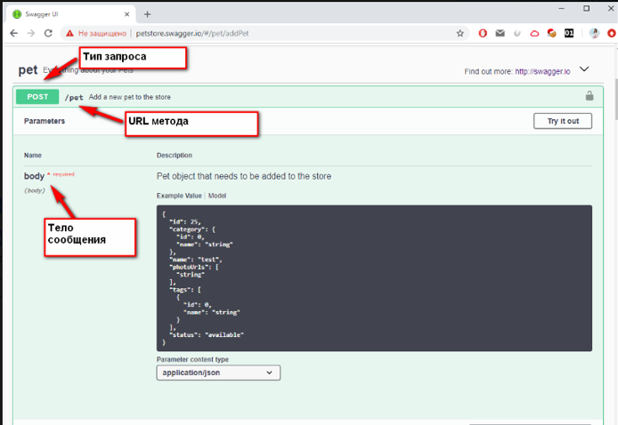
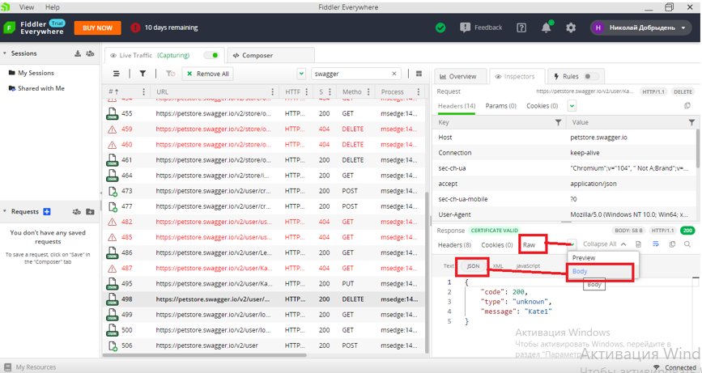
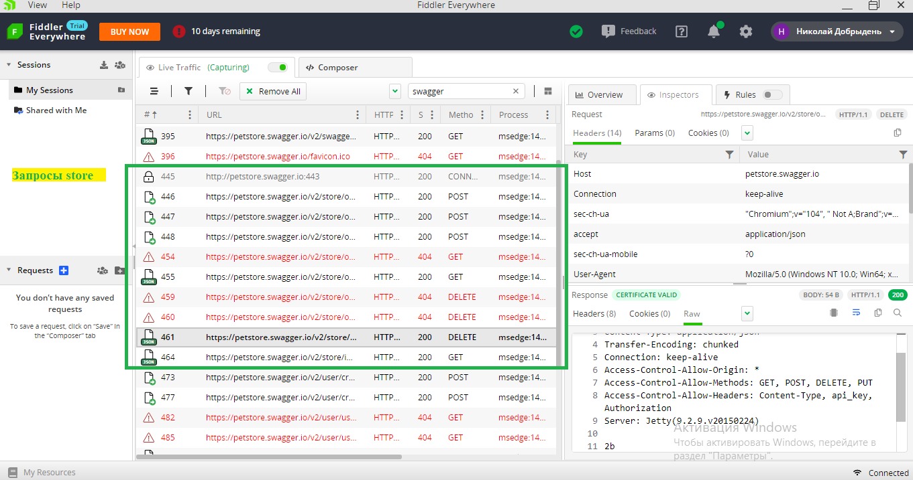

#### Структура запроса Pet

#### Пример response to a request (ответа на запрос)

#### 1. Выполненные запросы по блоку Store

#### 2. Выполненные запросы по блоку User

**Ответ преподавателя:** 1. Отлично:) 2. Отлично:)