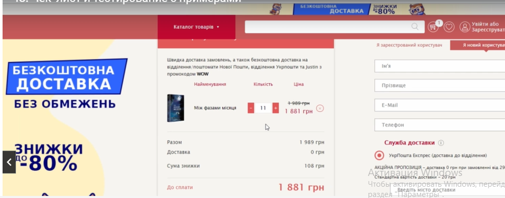

####  Пример преподавателя

**Результаты выполнения задания, оформленные в виде [чек-листа](/%D0%97%D0%B0%D0%B4%D0%B0%D0%BD%D0%B8%D0%B5%203_%D0%A7%D0%B5%D0%BA-%D0%BB%D0%B8%D1%81%D1%82_%D1%82%D0%B0%D0%B1%D0%BB%D0%B8%D1%86%D1%8B(Excel_Google%20Sheets)/Чек-лист.csv)**
**Ответ преподавателя:** Молодец:) Точки в конце шагов не ставят (такая культура общения у IT- шников) :)