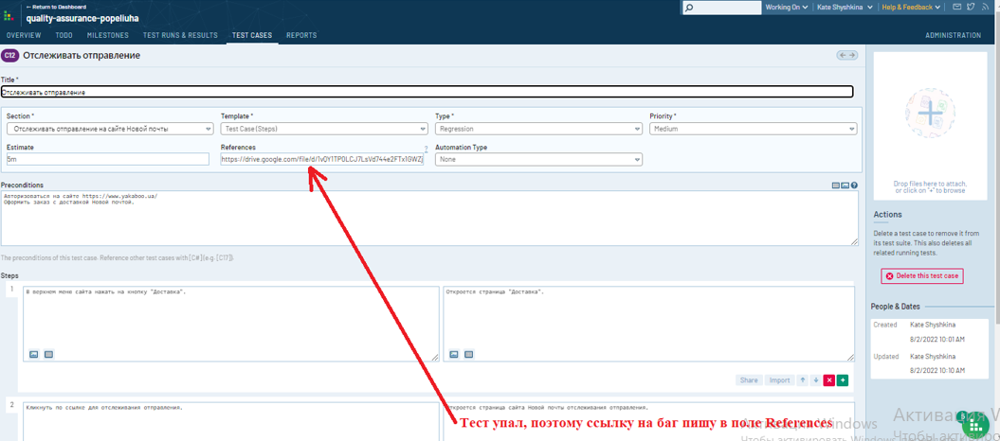
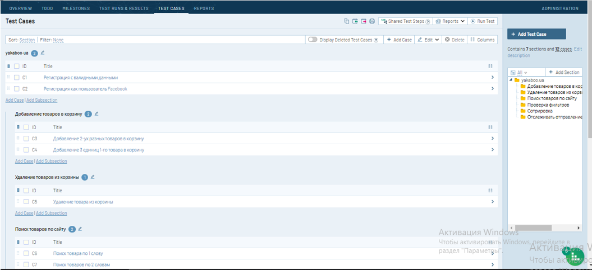

####  Примеры заполнения тест-кейсов в TestRail

#### [Тест-кейсы](/%D0%97%D0%B0%D0%B4%D0%B0%D0%BD%D0%B8%D0%B5%204_Test%20Rail_%D1%82%D0%B5%D1%81%D1%82%20%D0%BA%D0%B5%D0%B9%D1%81%D1%8B/Test%20Run%208_2_2022_TestRail.pdf)

####  [Тест-Репорт](/%D0%97%D0%B0%D0%B4%D0%B0%D0%BD%D0%B8%D0%B5%204_Test%20Rail_%D1%82%D0%B5%D1%81%D1%82%20%D0%BA%D0%B5%D0%B9%D1%81%D1%8B/Master_TestRail.pdf)

**Ответ преподавателя:** 1. Не должно быть зависимых тестов (С5 зависит от С4, С3). То есть, если в тесте мы удаляем товар из корзины, то его сначала надо добавить в корзину в том же тесте. Остальное молодец:) 2. Молодец:)